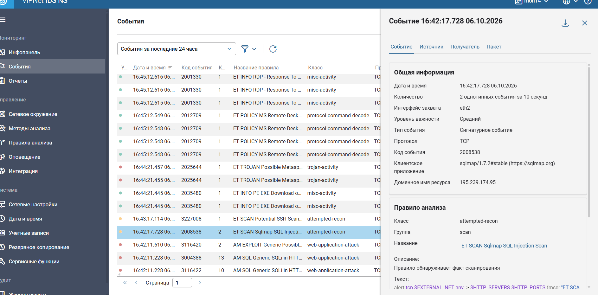
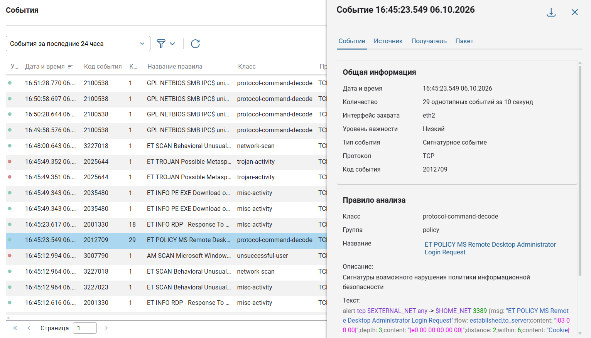

---
## Author
author:
  name: Назармамадов Умед Джумаевич
  degrees: студент
  email: umednazarmamadov40@gmail.com
  affiliation:
    - name: Российский университет дружбы народов
      country: Российская Федерация
      postal-code: 117198
      city: Москва
      address: ул. Миклухо-Маклая, д. 6
## Title
title: Защита контроллера домена предприятия
subtitle: Лабораторная работа №1 · Киберполигон Ampire
license: CC BY
date: today
date-format: "YYYY-MM-DD"
---

# Информация

## Докладчик

:::::::::::::: {.columns align=center}
::: {.column width="100%"}

  * Назармамадов Умед Джумаевич
  * студент, группа НФИбд-02-23
  * Российский университет дружбы народов
  * курс «Защита сетей и кибербезопасность»
  * [umednazarmamadov40@gmail.com](mailto:umednazarmamadov40@gmail.com)

:::
::::::::::::::

::: notes
- Поприветствовать аудиторию, представиться.
:::

# Вводная часть

## Цель и задачи

- **Цель**: расследовать инцидент на киберполигоне Ampire (сценарий №2 «Защита контроллера домена предприятия») и устранить все уязвимости.
- **Задачи**:
    - обнаружить этапы атаки по данным ViPNet IDS NS;
    - задокументировать каждый этап карточкой инцидента;
    - устранить причину уязвимости на поражённом узле;
    - подтвердить устранение по статусу полигона.

::: notes
- Три чётких задачи, по числу уязвимостей.
:::

## Сценарий атаки

| Этап | Действие | Источник → Цель |
|------|----------|------------------|
| 1 | SQL-инъекция → meterpreter | Kali → Web Server PHP (10.10.1.20) |
| 2 | Фишинг → meterpreter | Kali → Admin Workstation (10.10.4.10) |
| 3 | Перебор пароля RDP → захват AD | Web Server PHP → MS AD (10.10.2.10) |

Внешний атакующий закрепляется на периметре и движется вглубь сети к контроллеру домена.

::: notes
- Классическая цепочка kill chain: периметр → закрепление → горизонтальное перемещение → захват критичного актива.
:::

# Расследование и устранение

## Уязвимость 1. SQL-инъекция

{height=42%}

- Карточка: источник Kali (195.239.174.11), актив Web Server PHP
- Устранение: `ss -K` убита сессия, в `NewsController.php` добавлена валидация `is_numeric($id)`
- Попутно обнаружен и остановлен туннель `chisel` на сервере

::: notes
- Это не просто патч кода — пришлось убивать и активную сессию атакующего.
- Chisel — находка сверх методички, объясняет этап 3.
:::

## Карточка инцидента №1

{width=90%}

::: notes
- Источник, поражённый актив, индикаторы компрометации, рекомендации.
:::

## Уязвимость 2. Компрометация рабочей станции администратора

{height=42%}

- Фишинговое письмо → meterpreter-сессия на Admin Workstation
- Устранение: `taskkill` сессии, включён Windows Defender (`DisableAntiSpyware`, `DisableRealtimeMonitoring` убраны из реестра), перезапущена служба `WinDefend`
- Подтверждено: `RealTimeProtectionEnabled = True`, `AntivirusEnabled = True`

::: notes
- Политика отключала защиту на уровне реестра — простого "включить галочку" было недостаточно.
:::

## Карточка инцидента №2

{width=90%}

::: notes
:::

## Уязвимость 3. Захват контроллера домена

{height=42%}

- 29 запросов аутентификации за 10 секунд с уже скомпрометированного Web Server PHP на MS AD
- Устранение: удалена нелегитимная учётная запись `hacker` (`Remove-ADUser`), сменён пароль администратора домена (`net user Administrator *`)

::: notes
- Этот этап стал возможен именно благодаря chisel-туннелю с этапа 1.
:::

## Карточка инцидента №3

{width=90%}

::: notes
:::

# Результаты

## Итоговые статусы

| Уязвимость | Узел | Статус |
|------------|------|--------|
| SQL Injection | Web Server PHP | Устранено |
| Web portal meterpreter | Web Server PHP | Устранено |
| Windows Defender | Admin Workstation | Устранено (подтверждено командами) |
| Admin meterpreter | Admin Workstation | Устранено |
| AD Admin Password | MS Active Directory | Устранено |
| AD user | MS Active Directory | Устранено |

::: notes
- Все шесть пунктов закрыты, с доказательствами по каждому.
:::

## Главный вывод

Устранение одной уязвимости не останавливает атакующего, уже закрепившегося на другом узле: только последовательное закрытие всей цепочки — от периметра до контроллера домена — реально останавливает атаку.

::: notes
- Финальная мысль, которую нужно донести.
- Готов ответить на вопросы.
:::
