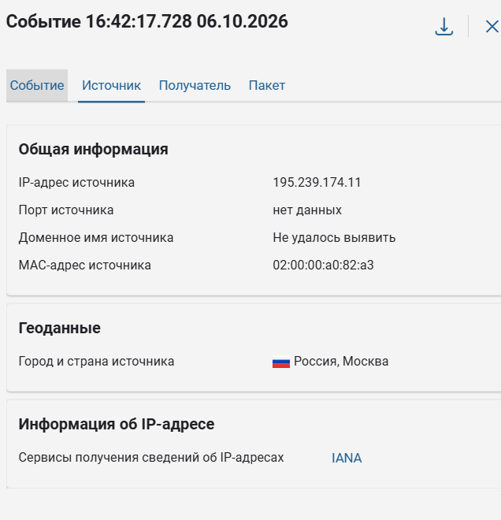
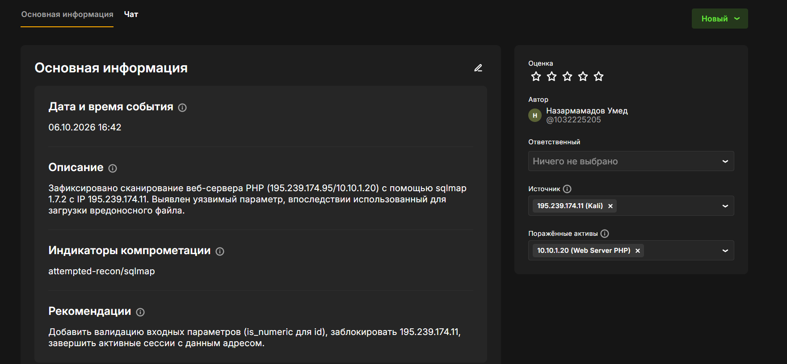
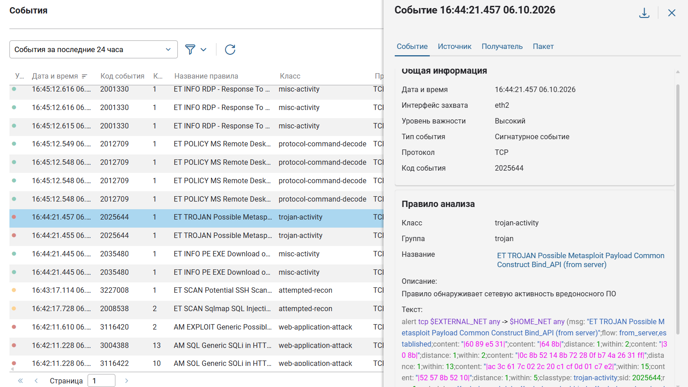
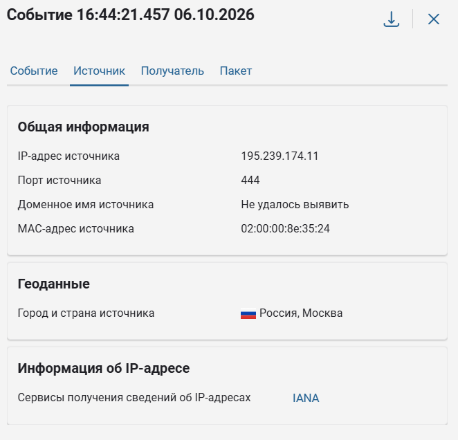
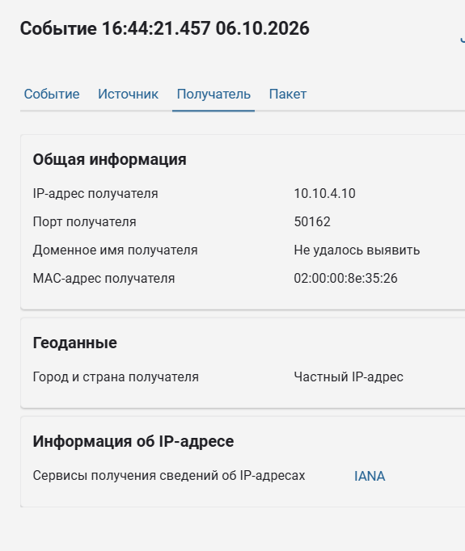
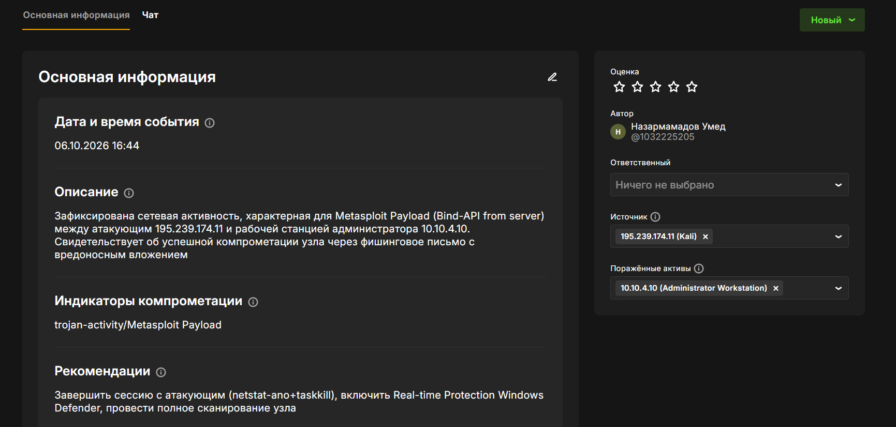
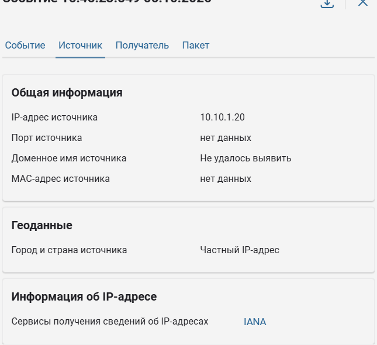
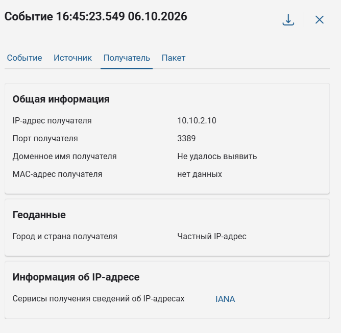
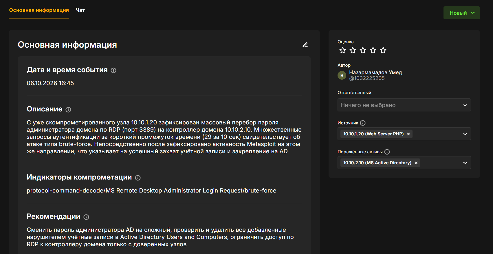

---
## Author
author:
  name: Назармамадов Умед Джумаевич
  degrees: студент
  email: umednazarmamadov40@gmail.com
  affiliation:
    - name: Российский университет дружбы народов
      country: Российская Федерация
      postal-code: 117198
      city: Москва
      address: ул. Миклухо-Маклая, д. 6

## Title
title: "Защита контроллера домена предприятия"
subtitle: "Расследование и устранение последствий инцидента на киберполигоне Ampire"
license: "CC BY"
abstract: |
  В отчёте представлены результаты выполнения лабораторной работы №1 по курсу «Защита сетей и кибербезопасность» на киберполигоне Ampire (сценарий №2 «Защита контроллера домена предприятия»).

  С использованием систем ViPNet IDS NS и ViPNet TIAS проведено расследование трёхэтапной атаки на корпоративную сеть: SQL-инъекция в веб-портал, компрометация рабочей станции администратора через фишинг и захват контроллера домена методом перебора пароля. Для каждого этапа атаки найдена уязвимость, заполнена карточка инцидента и выполнено устранение последствий на поражённом узле.

  Сделаны выводы об эффективности применённых мер реагирования и сформулированы рекомендации по повышению защищённости инфраструктуры.
keywords: [кибербезопасность, SIEM, IDS, расследование инцидентов, Active Directory, SQL-инъекция, Metasploit]
---

# Введение

## Актуальность

Своевременное обнаружение и реагирование на инциденты информационной безопасности — одна из ключевых задач защиты корпоративной сети. Атака на контроллер домена — особенно критичный сценарий, поскольку компрометация Active Directory даёт злоумышленнику полный контроль над всей доменной инфраструктурой предприятия. Отработка полного цикла реагирования (обнаружение → фиксация → устранение → подтверждение) на киберполигоне позволяет закрепить практические навыки работы с системами мониторинга (ViPNet IDS NS, ViPNet TIAS) и инструментами администрирования Windows/AD в условиях, приближенных к реальным.

## Цель работы

Расследовать инцидент информационной безопасности на киберполигоне Ampire по сценарию №2 «Защита контроллера домена предприятия»: обнаружить все этапы атаки по данным системы мониторинга, задокументировать их в виде карточек инцидентов и устранить последствия на каждом поражённом узле.

## Задачи

- Изучить топологию сети полигона и сценарий атаки.
- С помощью ViPNet IDS NS обнаружить и проанализировать события, соответствующие каждому этапу атаки.
- Для каждой обнаруженной уязвимости завести карточку инцидента с указанием источника, поражённого актива, индикаторов компрометации и рекомендаций.
- Устранить техническую причину и последствия каждой уязвимости непосредственно на поражённом узле.
- Подтвердить устранение по статусу уязвимости на панели полигона.

## Объект и предмет исследования

Объект исследования — сегмент корпоративной сети киберполигона Ampire (DMZ, Data Center, сегмент офисных пользователей). Предмет исследования — цепочка компрометации «внешний веб-сервер → рабочая станция администратора → контроллер домена» и методы её обнаружения и нейтрализации.

## Методы исследования

- Анализ сигнатурных событий системы обнаружения вторжений ViPNet IDS NS.
- Администрирование Linux (su, grep, find, nano, ss) для устранения уязвимости на веб-сервере.
- Администрирование Windows (PowerShell, реестр, службы) для устранения уязвимости на рабочей станции.
- Администрирование Active Directory (Get-ADUser, Remove-ADUser, net user) для устранения уязвимости на контроллере домена.

## Схема выполнения работы

Для каждой из трёх уязвимостей сценария выполнялась одна и та же последовательность действий (рис. -@fig-flowchart).

::: {#fig-flowchart}

```{mermaid}
%%| fig-width: 100%
graph TD
    A@{ shape: circle, label: "Начало" } --> B[Найти событие в ViPNet IDS NS]
    B --> C[Заполнить карточку инцидента]
    C --> D[Подключиться к поражённому узлу]
    D --> E[Устранить причину и последствия]
    E --> F[Подтвердить статус на панели полигона]
    F --> G{Есть ещё уязвимости?}
    G -- Да --> B
    G -- Нет --> J@{ shape: dbl-circ, label: "Конец" }
```

Блок-схема выполнения лабораторной работы

:::

# Теоретическая часть

## Сценарий атаки

Сценарий №2 моделирует атаку внешнего злоумышленника (Kali, 195.239.174.11) на корпоративную сеть предприятия с целью захвата контроллера домена (табл. -@tbl-attack-chain).

| Этап | Действие атакующего | Источник → Цель |
|------|---------------------|------------------|
| 1 | Сканирование и эксплуатация SQL-инъекции в параметре `id` веб-портала через `sqlmap`, загрузка PHP reverse shell, получение meterpreter-сессии | Kali (195.239.174.11) → Web Server PHP (195.239.174.95 / 10.10.1.20) |
| 2 | Фишинговое письмо администратору с вредоносным вложением (Metasploit payload), получение meterpreter-сессии на рабочей станции | Kali (195.239.174.11) → Administrator Workstation (10.10.4.10) |
| 3 | Перебор пароля администратора домена по RDP с уже скомпрометированного веб-сервера, добавление привилегированной учётной записи в домен | Web Server PHP (10.10.1.20) → MS Active Directory (10.10.2.10) |

: Этапы атаки по сценарию №2 {#tbl-attack-chain}

## Топология сети полигона

Сеть полигона разделена на сегменты: периметр (Kali, внешний атакующий), DMZ 10.10.1.0/24 (Web Server PHP, CMS Drupal, Apache Tomcat, SecOnion), Data Center 10.10.2.0/24 (MS Active Directory, MS Exchange, MySQL, ViPNet EPP/IDS NS/TIAS и др.) и сегмент офисных пользователей 10.10.4.0/24 (Administrator Workstation, рабочие станции сотрудников).

## Используемые средства мониторинга

**ViPNet IDS NS** — система обнаружения вторжений на основе сигнатурного анализа сетевого трафика, применялась для первичного обнаружения всех трёх событий атаки. **ViPNet TIAS** — система корреляционного анализа событий (аналог SIEM), используется для сопоставления разрозненных событий в единую картину инцидента.

# Материалы и методы

Работа выполнялась на инфраструктуре киберполигона Ampire через удалённое рабочее место (Response Team, 10.140.2.153), доступное по RDP. С него выполнялось подключение по SSH (PuTTY) к веб-серверу и по RDP к рабочей станции администратора и контроллеру домена. Для анализа событий использовалась веб-консоль ViPNet IDS NS. Учётные данные для всех узлов полигона получены из файла `IT-infrastructure Passwords.pdf`, расположенного на рабочем столе удалённого рабочего места.

# Выполнение лабораторной работы

## Уязвимость 1. SQL-инъекция на веб-портале

### Обнаружение

В ViPNet IDS NS по правилу `ET SCAN Sqlmap SQL Injection Scan` (код события 2008538, класс `attempted-recon`) зафиксировано сканирование веб-сервера PHP инструментом `sqlmap/1.7.2` с источника 195.239.174.11 (рис. -@fig-sql-event, -@fig-sql-source). Непосредственно после — событие `ET TROJAN Possible Metasploit Payload` (рис. -@fig-ms-event, -@fig-ms-source), подтверждающее успешную эксплуатацию уязвимости и установление meterpreter-сессии на порту 4444.

::: {#fig-sql-event}
{width=90%}

Событие ViPNet IDS NS: `ET SCAN Sqlmap SQL Injection Scan`, источник sqlmap/1.7.2
:::

::: {#fig-sql-source}
{width=70%}

Источник события: IP 195.239.174.11, геолокация Россия, Москва
:::

### Карточка инцидента

Заведена карточка инцидента: источник — Kali (195.239.174.11), поражённый актив — Web Server PHP (10.10.1.20), индикаторы компрометации — `attempted-recon/sqlmap`, рекомендации — добавить валидацию входных параметров (`is_numeric` для `id`), заблокировать IP 195.239.174.11, завершить активные сессии (рис. -@fig-card-1).

::: {#fig-card-1}
{width=90%}

Карточка инцидента №1: SQL-инъекция на веб-портале
:::

### Устранение

На Web Server PHP (10.10.1.20) по SSH (PuTTY) выполнена эскалация до root (`su -`), после чего:

1. Найдена и завершена активная meterpreter-сессия атакующего по сокету:
   ```bash
   ss -tp
   ss -K dst 195.239.174.11 dport = 4444
   ```
2. Обнаружен и завершён процесс `chisel` — инструмент туннелирования, с помощью которого атакующий организовал проброс трафика из внутренней сети наружу (важная деталь, не описанная явно в методических указаниях, но объясняющая, каким образом внешний атакующий впоследствии получил доступ к внутреннему RDP контроллера домена).
3. В файле `/var/www/html/htdocs/polygon/controllers/NewsController.php` устранена причина уязвимости — отсутствие валидации параметра `$_GET['id']`:

   ```php
   public function actionView()
   {
       $id = $_GET['id'];
       if (!is_numeric($id)) {
           $id = 1;
       }
       $model = News::model()->findById($id);
       $comments = Comment::model()->findByAttributes(array('post_id'=>$id));
       $this->render('news/view', array('model1'=>$model, 'comments'=>$comments));
   }
   ```

После выполнения указанных действий статусы «SQL Injection» и «Web portal meterpreter» на панели полигона изменились на «Устранено».

## Уязвимость 2. Отключённая антивирусная защита на рабочей станции администратора

### Обнаружение

В ViPNet IDS NS зафиксировано событие `ET TROJAN Possible Metasploit Payload Common Construct Bind_API (from server)` (код 2025644, класс `trojan-activity`, уровень важности «Высокий») между атакующим 195.239.174.11 (порт 444) и рабочей станцией администратора 10.10.4.10 (порт 50162) — рис. -@fig-ms-event – -@fig-ms-dest. Событие свидетельствует об успешной компрометации узла через фишинговое письмо с вредоносным вложением.

::: {#fig-ms-event}
{width=90%}

Событие ViPNet IDS NS: `ET TROJAN Possible Metasploit Payload Common Construct Bind_API`
:::

::: {#fig-ms-source}
{width=70%}

Источник события: 195.239.174.11, порт 444
:::

::: {#fig-ms-dest}
{width=70%}

Получатель события: Administrator Workstation 10.10.4.10, порт 50162
:::

### Карточка инцидента

Источник — Kali (195.239.174.11), поражённый актив — Administrator Workstation (10.10.4.10), индикаторы компрометации — `trojan-activity/Metasploit Payload`, рекомендации — завершить сессию с атакующим (`netstat -ano` + `taskkill`), включить Real-time Protection Windows Defender, провести полное сканирование узла (рис. -@fig-card-2).

::: {#fig-card-2}
{width=90%}

Карточка инцидента №2: компрометация рабочей станции администратора
:::

### Устранение

На Administrator Workstation (10.10.4.10) по RDP, в PowerShell от имени администратора:

1. Обнаружена и завершена сессия атакующего:
   ```powershell
   netstat -ano
   taskkill /f /pid 7288
   ```
2. Проверено состояние защиты — обнаружено, что политикой был отключён как Windows Defender (`DisableAntiSpyware`), так и Real-time Protection (`DisableRealtimeMonitoring = True`):
   ```powershell
   Get-MpPreference | Select DisableRealtimeMonitoring, DisableAntiSpyware
   ```
3. Устранена причина — удалены запрещающие политики из реестра, перезапущена служба защиты:
   ```powershell
   REG DELETE "HKLM\SOFTWARE\Policies\Microsoft\Windows Defender" /v DisableAntiSpyware
   REG DELETE "HKLM\SOFTWARE\Policies\Microsoft\Windows Defender\Real-Time Protection" /v DisableRealtimeMonitoring /f
   Start-Service WinDefend
   ```
4. Подтверждено восстановление защиты:
   ```powershell
   Get-MpComputerStatus | Select RealTimeProtectionEnabled, AntivirusEnabled
   ```
   Результат: `RealTimeProtectionEnabled = True`, `AntivirusEnabled = True`.

После завершения сессии атакующего последствие «Admin meterpreter» на панели полигона сразу изменилось на «Устранено». Статус самой уязвимости временно отображался как «Сервер недоступен» из-за потери связи агента мониторинга с узлом после перезапуска служб — технически уязвимость была устранена и подтверждена показанными выше командами до наступления этого сбоя.

## Уязвимость 3. Перебор пароля администратора домена и добавление привилегированного пользователя

### Обнаружение

В ViPNet IDS NS по правилу `ET POLICY MS Remote Desktop Administrator Login Request` (код 2012709, класс `protocol-command-decode`) зафиксировано 29 однотипных событий за 10 секунд — характерный признак перебора пароля (brute-force) по RDP (рис. -@fig-rdp-event – -@fig-rdp-dest). Источник — уже скомпрометированный веб-сервер (10.10.1.20), получатель — контроллер домена (10.10.2.10, порт 3389).

::: {#fig-rdp-event}
{width=90%}

Событие ViPNet IDS NS: `ET POLICY MS Remote Desktop Administrator Login Request`, 29 событий за 10 секунд
:::

::: {#fig-rdp-source}
{width=70%}

Источник события: 10.10.1.20 (ранее скомпрометированный Web Server PHP)
:::

::: {#fig-rdp-dest}
{width=70%}

Получатель события: MS Active Directory 10.10.2.10, порт 3389
:::

### Карточка инцидента

Источник — Web Server PHP (10.10.1.20), поражённый актив — MS Active Directory (10.10.2.10), индикаторы компрометации — `protocol-command-decode/MS Remote Desktop Administrator Login Request/brute-force`, рекомендации — сменить пароль администратора AD, проверить и удалить все добавленные нарушителем учётные записи, ограничить доступ по RDP к контроллеру домена только с доверенных узлов (рис. -@fig-card-3).

::: {#fig-card-3}
{width=90%}

Карточка инцидента №3: перебор пароля администратора домена
:::

### Устранение

На MS Active Directory (10.10.2.10) по RDP, в PowerShell от имени администратора:

1. Через Active Directory Users and Computers обнаружена нелегитимная учётная запись `hacker`.
2. Проверено членство в привилегированных группах; учётная запись удалена из домена:
   ```powershell
   Remove-ADUser -Identity hacker -Confirm:$false
   Get-ADUser -Filter {SamAccountName -eq "hacker"}
   ```
   Повторный запрос вернул пустой результат — учётная запись удалена.
3. Сменён пароль администратора домена, скомпрометированный перебором:
   ```cmd
   net user Administrator *
   ```

После выполнения этих действий статусы «AD Admin Password» и «AD user» на панели полигона изменились на «Устранено».

# Результаты

По итогам расследования и реагирования на панели «Уязвимости и последствия» киберполигона зафиксированы следующие статусы (табл. -@tbl-results):

| Уязвимость / последствие | Поражённый узел | Статус |
|---------------------------|------------------|--------|
| SQL Injection | Web Server PHP (10.10.1.20) | Устранено |
| Web portal meterpreter | Web Server PHP (10.10.1.20) | Устранено |
| Уязвимость 2 (Windows Defender) | Administrator Workstation (10.10.4.10) | Устранено технически; статус панели на момент фиксации — «Сервер недоступен» |
| Admin meterpreter | Administrator Workstation (10.10.4.10) | Устранено |
| AD Admin Password | MS Active Directory (10.10.2.10) | Устранено |
| AD user | MS Active Directory (10.10.2.10) | Устранено |

: Итоговые статусы устранения уязвимостей {#tbl-results}

Для каждого из трёх этапов атаки обнаружено исходное событие в ViPNet IDS NS, заведена и заполнена карточка инцидента с источником, поражённым активом, индикаторами компрометации и рекомендациями, выполнено техническое устранение причины на поражённом узле.

# Обсуждение результатов

Все три уязвимости сценария последовательно соответствуют реальной цепочке компрометации: эксплуатация веб-уязвимости на периметре → закрепление на внутреннем узле через фишинг → горизонтальное перемещение и захват контроллера домена методом перебора пароля. Такая последовательность типична для целенаправленных атак (APT) на корпоративные сети и подчёркивает важность эшелонированной защиты: устранение только одной уязвимости (например, патч SQL-инъекции) не остановило бы атакующего, уже закрепившегося на рабочей станции администратора.

Отдельного внимания заслуживает обнаруженный в ходе устранения первой уязвимости процесс `chisel` на веб-сервере — инструмент туннелирования, не упомянутый явно в методических указаниях, но объясняющий технический механизм, с помощью которого внешний атакующий (195.239.174.11) смог инициировать RDP-перебор против внутреннего адреса контроллера домена (10.10.2.10) в третьем эпизоде: трафик пробрасывался через скомпрометированный веб-сервер как через точку поворота (pivot).

Временная недоступность агента мониторинга на Administrator Workstation после перезапуска службы Windows Defender — не следствие ошибки в действиях по реагированию (что подтверждается командой `Get-MpComputerStatus`, выполненной непосредственно до потери связи), а особенность инфраструктуры полигона.

# Заключение

- Цель работы достигнута: проведено полное расследование трёхэтапного инцидента на киберполигоне Ampire с обнаружением, документированием и устранением всех предусмотренных сценарием уязвимостей.
- Для каждого этапа атаки (SQL-инъекция, компрометация рабочей станции через фишинг, захват контроллера домена перебором пароля) выполнен полный цикл: обнаружение по данным ViPNet IDS NS → заполнение карточки инцидента → устранение технической причины → подтверждение статуса.
- Дополнительно выявлен и нейтрализован инструмент туннелирования (`chisel`), использованный атакующим для организации pivot-доступа во внутреннюю сеть — деталь, важная для полного понимания механизма атаки.
- Рекомендации для реальной инфраструктуры: внедрить валидацию входных параметров на уровне веб-приложений, обеспечить политику запрета отключения антивирусной защиты обычными пользователями (GPO), ограничить RDP-доступ к контроллерам домена списком доверенных узлов и включить блокировку учётных записей после нескольких неудачных попыток входа.
